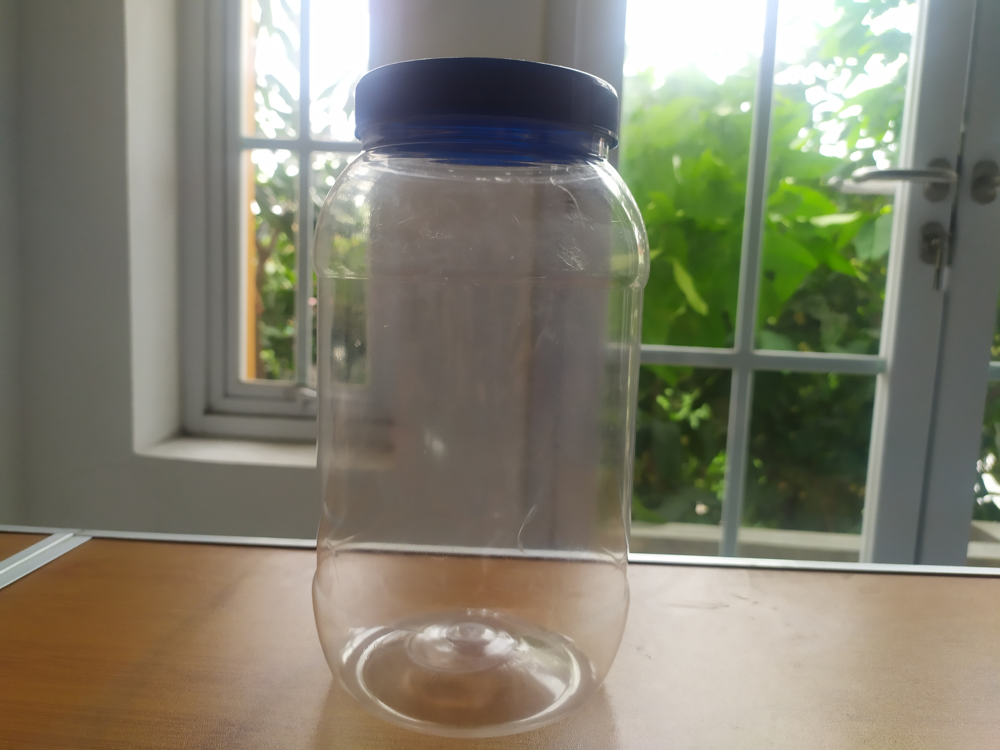
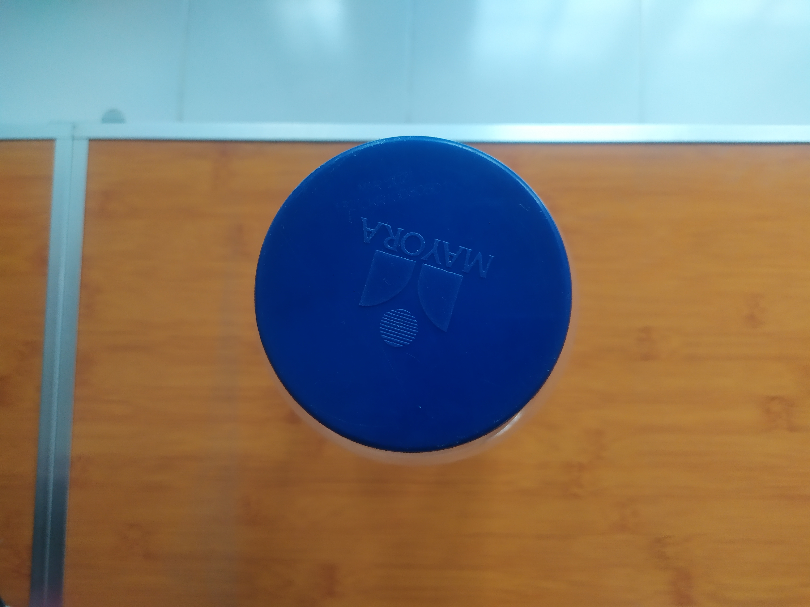
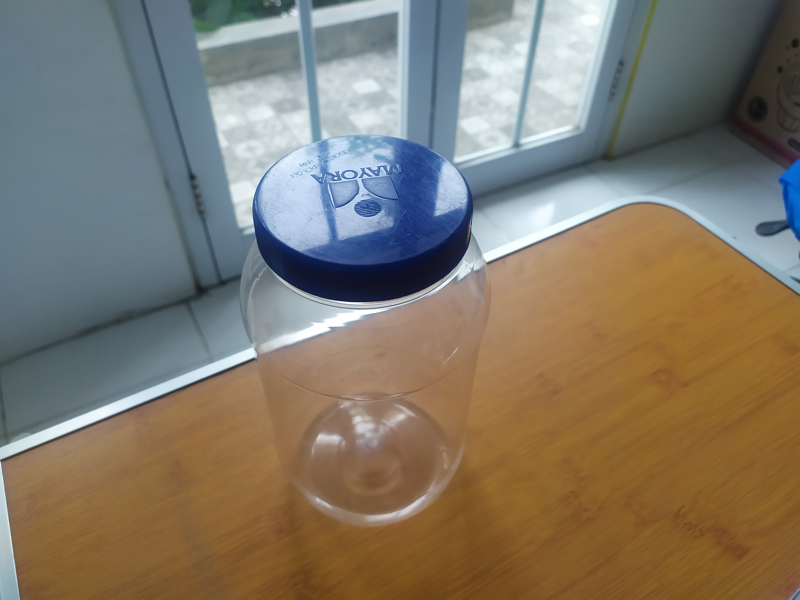
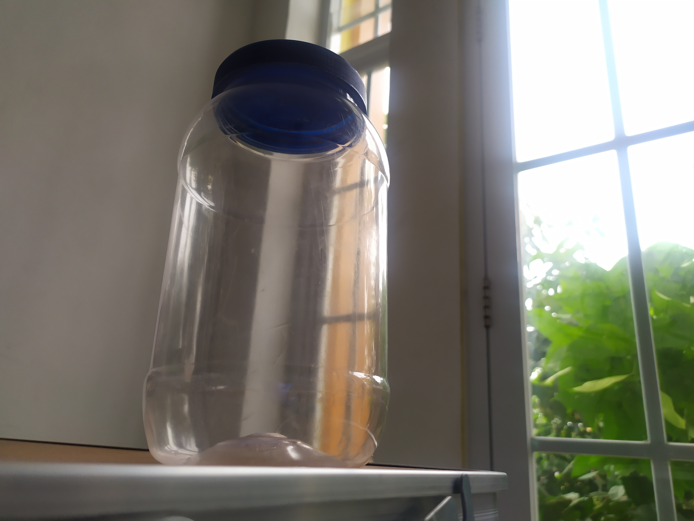

# Jar
I want to draw a jar

1. The application consists of HTML, JavaScript and CSS (optional) files.
2. The application contains only one Canvas.
3. The JavaScript application comprises the definition of vertices that embody the shape of the object photographed in the previous assignment: Select two of the four photos.
4. The definition of vertex includes position (x, y) and color (r, g, b) as represented on the selected photos.
5. The shape as shown on one of the selected photos is rendered on the left side of the Canvas: Located in the clip space between X = -1.0 and X = 0.0 axes.
6. The shape as shown in another selected photo is rendered on the right side of the Canvas: Located in the clip space between X = 0.0 and X = 1.0 axes.
7. The rendering result on the right side of the Canvas is animated vertically, bouncing back between the top and the bottom walls of the Canvas, with a speed of 0.0xxx units, where xxx is the last three digits of the NRP.

[Result](https://naufalfajar.github.io/)
